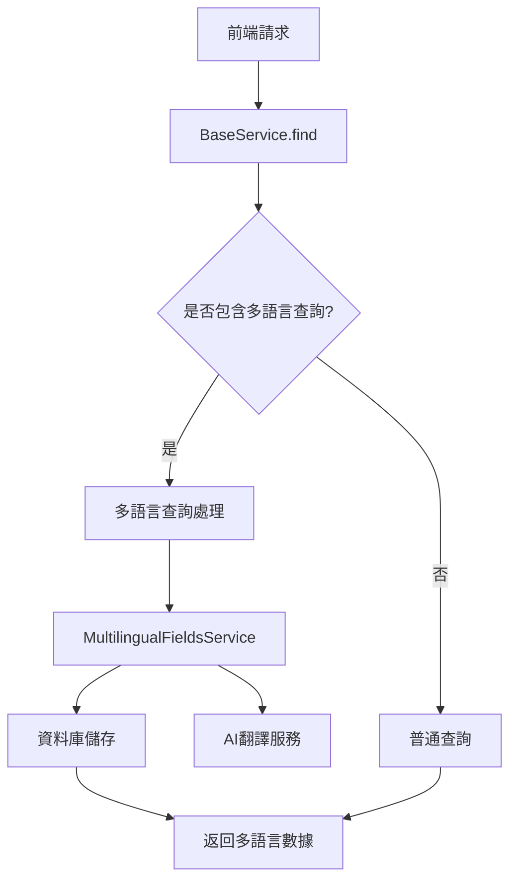

# Multilingual Fields

The multilingual column system is the core module for processing international content in the project. It allows the same column to store content in multiple languages ​​and provides automatic translation, query and management functions.

## System architecture

### Core Components



### Data structure

#### MultilingualFieldsEntity
```typescript
{
  id: string // 主鍵ID
  fieldId: string // 對應欄位ID (格式: multilingual-xxxxx)
  language: string // 語言代碼 (如: zh-TW, en, ja)
  value: string // 該語言的欄位值
  // 繼承 BaseEntity 的基礎欄位
}
```

## How it works

### 1. Multilingual field recognition

The system checks whether the column value is`multilingual-`To identify multilingual fields at the beginning:

```typescript
// 普通欄位
{
  title: "Hello World",
  description: "This is a description"
}

// 多語言欄位
{
  title: "multilingual-12345",      // 多語言欄位
  description: "multilingual-67890" // 多語言欄位
}
```

### 2. Query process

#### Front-end query request
```typescript
// 前端發送查詢請求
{
  pageSize: 10,
  currentPage: 1,
  multilingualFields: ["title", "description"], // 指定需要多語言查詢的欄位
  title: "標題內容" // 根據多語言內容查詢
}
```

#### Backend processing flow
1. **Recognize multilingual fields**: Check`multilingualFields`parameter
2. **Query multilingual mapping**:`multilingual-fields`Find the corresponding one in the table`fieldId`
3. **Generate query combination**: Use Cartesian product to generate all possible query conditions
4. **Execute database query**: Use`fieldId`Conduct actual query
5. **Attach multilingual data**: Attach multilingual content to query results

### 3. Return the data structure

```typescript
// 查詢結果
{
  list: [
    {
      id: "1",
      title: "multilingual-12345",
      description: "multilingual-67890",
      // 其他欄位...

      // 自動附加的多語言數據
      multilingualFields: {
        title: [
          { id: "1", fieldId: "multilingual-12345", language: "zh-TW", value: "標題" },
          { id: "2", fieldId: "multilingual-12345", language: "en", value: "Title" },
          { id: "3", fieldId: "multilingual-12345", language: "ja", value: "タイトル" }
        ],
        description: [
          { id: "4", fieldId: "multilingual-67890", language: "zh-TW", value: "描述" },
          { id: "5", fieldId: "multilingual-67890", language: "en", value: "Description" }
        ]
      }
    }
  ],
  total: 1
}
```

## Core functions

### 1. Multilingual content management

#### Create multilingual content
```typescript
// 創建單個多語言欄位
await multilingualFieldsService.create({
  fieldId: 'multilingual-12345',
  language: 'zh-TW',
  value: '標題內容'
})

// 批次創建
await multilingualFieldsService.createBatch([
  { fieldId: 'multilingual-12345', language: 'zh-TW', value: '標題' },
  { fieldId: 'multilingual-12345', language: 'en', value: 'Title' },
  { fieldId: 'multilingual-12345', language: 'ja', value: 'タイトル' }
])
```

#### Query multilingual content
```typescript
// 查詢特定欄位的所有語言版本
const result = await multilingualFieldsService.find({
  fieldId: 'multilingual-12345',
  pageSize: 0 // 不分頁
})
```

#### Update multilingual content
```typescript
// 更新特定語言版本
await multilingualFieldsService.update({
  id: '1',
  value: '新的標題內容'
})
```

### 2. AI automatic translation

#### Language conversion function
```typescript
// 將文字轉換為多種語言
const result = await multilingualFieldsService.convertLanguage({
  text: "Hello World",
  targetLanguages: ["zh-TW", "ja", "ko"]
})

// 返回結果
{
  "zh-TW": "你好世界",
  "ja": "こんにちは世界",
  "ko": "안녕하세요 세계"
}
```

#### Translation process
1. Receive original text and target language lists
2. Calling AI Translation Service (ChatGPT)
3. Analyze the translation results of JSON format
4. Returns the translation content corresponding to the language code

### 3. Status Management

#### Block/unblock multilingual columns
```typescript
// 封鎖多語言欄位
await multilingualFieldsService.block('1')

// 解封鎖多語言欄位
await multilingualFieldsService.unblock('1')
```

## Use scenarios

### 1. Content Management System

```typescript
// 文章管理
const article = {
  title: 'multilingual-article-001',
  content: 'multilingual-article-002',
  category: 'multilingual-category-001'
}

// 查詢時自動返回多語言內容
const result = await find({
  dto: {
    multilingualFields: ['title', 'content', 'category'],
    title: '文章標題'
  },
  repository: articleRepository
})
```

### 2. Product Catalog

```typescript
// 產品資訊
const product = {
  name: 'multilingual-product-001',
  description: 'multilingual-product-002',
  specifications: 'multilingual-product-003'
}
```

### 3. User interface text

```typescript
// 界面文本
const uiText = {
  buttonText: 'multilingual-ui-001',
  errorMessage: 'multilingual-ui-002',
  helpText: 'multilingual-ui-003'
}
```

## Best Practices

### 1. Column naming specifications

```typescript
// 推薦的 fieldId 命名格式
const fieldId = `multilingual-${entityType}-${fieldName}-${uniqueId}`

// 範例
'multilingual-article-title-001'
'multilingual-product-name-002'
'multilingual-ui-button-003'
```

### 2. Language code standards

```typescript
// 使用標準的語言代碼
const languages = {
  'zh-TW': '繁體中文',
  'zh-CN': '簡體中文',
  'en': 'English',
  'ja': '日本語',
  'ko': '한국어'
}
```

### 3. Optimization of performance

#### Query Optimization
```typescript
// 只在需要時使用多語言查詢
const result = await find({
  dto: {
    multilingualFields: ['title'], // 只查詢需要的欄位
    title: '標題'
  },
  repository: articleRepository
})
```

#### Cache Strategy
```typescript
// 對頻繁查詢的多語言內容進行快取
const cacheKey = `multilingual-${fieldId}`
const cached = await cacheService.get(cacheKey)
if (cached)
  return cached

const result = await multilingualFieldsService.find({ fieldId })
await cacheService.set(cacheKey, result, 3600) // 快取1小時
```

### 4. Error handling

```typescript
try {
  const result = await multilingualFieldsService.convertLanguage({
    text: 'Hello',
    targetLanguages: ['zh-TW', 'ja']
  })
}
catch (error) {
  if (error instanceof BadRequestException) {
    // 處理翻譯失敗
    console.error('翻譯失敗:', error.message)
  }
}
```

## Database design

### Table structure

```sql
CREATE TABLE system_multilingual_fields (
  id BIGINT PRIMARY KEY AUTO_INCREMENT COMMENT '主鍵ID',
  field_id VARCHAR(50) NOT NULL COMMENT '對應欄位ID',
  language VARCHAR(50) NOT NULL COMMENT '對應語言',
  value VARCHAR(255) NOT NULL COMMENT '欄位值',
  remark VARCHAR(255) COMMENT '備註',
  status TINYINT DEFAULT 1 COMMENT '狀態 0:禁用 1:啟用',
  is_deleted TINYINT DEFAULT 0 COMMENT '是否刪除 0:否 1:是',
  creator BIGINT COMMENT '建立人',
  create_time DATETIME DEFAULT CURRENT_TIMESTAMP COMMENT '建立時間',
  updater BIGINT COMMENT '更新人',
  update_time DATETIME ON UPDATE CURRENT_TIMESTAMP COMMENT '更新時間'
);
```

### Indexing suggestions

```sql
-- 主要查詢索引
CREATE INDEX idx_field_id ON system_multilingual_fields(field_id);
CREATE INDEX idx_language ON system_multilingual_fields(language);
CREATE INDEX idx_field_language ON system_multilingual_fields(field_id, language);

-- 狀態過濾索引
CREATE INDEX idx_status_deleted ON system_multilingual_fields(status, is_deleted);
```

## Configuration instructions

### Environment variables

```env
# AI 翻譯服務配置
CHAT_GPT_API_KEY=your_chatgpt_api_key

# 多語言相關配置
DEFAULT_LANGUAGE=zh-TW
SUPPORTED_LANGUAGES=zh-TW,en,ja,ko
```

### Service configuration

```typescript
// 在模組中配置
@Module({
  imports: [
    TypeOrmModule.forFeature([MultilingualFieldsEntity]),
    // 其他依賴...
  ],
  providers: [MultilingualFieldsService],
  controllers: [MultilingualFieldsController],
  exports: [MultilingualFieldsService]
})
export class MultilingualFieldsModule {}
```

## Frequently Asked Questions

### 1. Multilingual query performance issues

**Problem**: Multiple multilingual columns will generate Cartesian products, affecting query performance

**Solution**:
- Limit the number of multilingual fields to be queried simultaneously
- Reduce duplicate queries using cache
- Consider using full text search index

### 2. Translation accuracy issues

**Problem**: AI translation may not be accurate enough

**Solution**:
- Provides manual proofreading function
- Supports custom translation
- Use professional translation services

### 3. Data consistency issues

**Problem**: Multilingual data may not be synchronized

**Solution**:
- Implement data synchronization mechanism
- Provide data verification function
- Regularly check data integrity

## Extended features

### 1. Version control

```typescript
// 支持多語言內容的版本控制
interface MultilingualVersion {
  fieldId: string
  language: string
  version: number
  value: string
  isActive: boolean
}
```

### 2. Batch operation

```typescript
// 批次更新多語言內容
await multilingualFieldsService.updateBatch([
  { id: '1', value: '新內容1' },
  { id: '2', value: '新內容2' }
])
```

### 3. Import and export

```typescript
// 導出多語言數據
const exportData = await multilingualFieldsService.export({
  fieldIds: ['multilingual-001', 'multilingual-002'],
  languages: ['zh-TW', 'en']
})

// 導入多語言數據
await multilingualFieldsService.import(importData)
```

## Summarize

The multilingual column system provides a complete international solution, and realizes automated multilingual query and management through deep integration with BaseService. The system is flexible and easy to expand, and can meet the needs of various multilingual applications.

Key Benefits:
- **Automation**: Seamless integration with BaseService
- **Intelligent**: AI automatic translation function
- **Flexibility**: Supports multilingualization of any column
- **Performance Optimization**: Smart Query and Cache Mechanism
- **Easy to use**: Simple API interface
