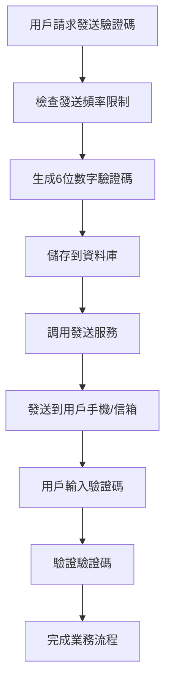

# Verification Code Send Service Integration Guide

This guide will teach you how to integrate your verification code sending service into your project. At present, the project has completed the generation, storage and verification logic of verification codes, and you only need to implement the actual sending function.

## Existing verification code architecture

### Core Components

1. **VerifyCodeUtils**: Verify code tool class, providing a unified interface for generation, sending and verification
2. **VerifyCodeService**: Verification Code Database Operation Service
3. **AuthService**: Authentication service, use verification code to register and password reset

### Verification code process



## Integration point description

### 1. Main integration location

exist`src/utils/verify-code-utils.ts`There are two TODO mark locations in the file:

```typescript
// 第72行 - 新驗證碼發送
// TODO：在此處執行發送驗證碼的邏輯

// 第101行 - 重新發送驗證碼
// TODO：在此處執行發送驗證碼的邏輯
```

### 2. Available parameters

At the integration point, you can use the following parameters:

```typescript
// 驗證碼資訊
const code = StrGenerator.generateNumeric(6) // 6位數字驗證碼

// 用戶資訊
const userId = userId // 用戶ID（可能為空）
const userEmail = userEmail // 用戶信箱
const userMobile = userMobile // 用戶手機號碼

// 場景資訊
const type = type // 'email' 或 'mobile'
const scene = scene // 'register' 或 'retrieve-password'
```

## Integration Solution

### Solution 1: Integrate directly in VerifyCodeUtils

**Advantages**: Simple and direct, small modification
**Disadvantages**: High coupling degree, not conducive to expansion

**Implementation ideas**:
1. Add send logic in the TODO location
2. according to`type`Determine the sending method (mailbox/mobile phone)
3. Call the corresponding sending service

### Solution 2: Create an independent sending service

**Pros**: Decoupling, easy to maintain and test
**Disadvantages**: Need to create additional service classes

**Implementation ideas**:
1. create`VerifyCodeSenderService`Serve
2. Inject and call in VerifyCodeUtils
3. Supports multiple sending methods (mailbox, message, push, etc.)

### Solution 3: Use event-driven mode

**Advantages**: Completely decoupled, supports asynchronous processing
**Disadvantages**: The architecture is complex and the event system is required

**Implementation ideas**:
1. Define verification code sending event
2. Send events at TODO location
3. Create event listener to process send logic

## Specific integration steps

### Step 1: Select an integration plan

Choose the right solution based on your project needs and team technology stack. It is recommended to use the **Scheme 2**, which not only maintains the neatness of the code, but also facilitates subsequent expansion.

### Step 2: Create a sending service

Create a special verification code sending service, for example:

```typescript
// src/services/verify-code-sender.service.ts
@Injectable()
export class VerifyCodeSenderService {
  async sendEmailCode(email: string, code: string, scene: string) {
    // 實現信箱發送邏輯
  }

  async sendMobileCode(mobile: string, code: string, scene: string) {
    // 實現簡訊發送邏輯
  }
}
```

### Step 3: Modify VerifyCodeUtils

Add send logic in the TODO location:

```typescript
// 注入發送服務
constructor(private readonly senderService: VerifyCodeSenderService) {}

// 在生成驗證碼後添加發送邏輯
if (type === 'email') {
  await this.senderService.sendEmailCode(userEmail, code, scene)
} else if (type === 'mobile') {
  await this.senderService.sendMobileCode(userMobile, code, scene)
}
```

### Step 4: Configure environment variables

Add the configuration required for sending services:

```env
# 信箱服務配置
SMTP_HOST=smtp.example.com
SMTP_PORT=587
SMTP_USER=your-email@example.com
SMTP_PASS=your-password

# 簡訊服務配置
SMS_API_KEY=your-sms-api-key
SMS_API_URL=https://api.sms-provider.com
```

## Common sending service integration

### 1. Mailbox sending service

**Recommended Service Provider**:
- SendGrid
- AWS SES
- Alibaba Cloud Email Push
- Tencent Cloud Email Push

**Integration Points**:
- Configure SMTP or API interface
- Design email templates
- Processing send failed and retry

### 2. Send message service

**Recommended Service Provider**:
- Alibaba Cloud Message Service
- Tencent Cloud News
- Twilio
- Huawei Cloud News

**Integration Points**:
- Application newsletter template
- Configure signature and template ID
- Handle the send frequency limit

### 3. Push notifications

**Applicable scenarios**:
- Mobile in-app verification code
- Instant messaging software notifications

**Integration Points**:
- Integrated push service SDK
- Handle device token management
- Design push content templates

## Error handling suggestions

### 1. Send failed processing

```typescript
try {
  await this.senderService.sendCode(...)
} catch (error) {
  // 記錄錯誤日誌
  console.error('驗證碼發送失敗:', error)

  // 可選：刪除已創建的驗證碼記錄
  await verifyCodeService.deleteUserAllVerifyCodes(userId)

  // 拋出用戶友好的錯誤資訊
  throw new BadRequestException('驗證碼發送失敗，請稍後重試')
}
```

### 2. Retry mechanism

```typescript
async sendWithRetry(sendFunction: () => Promise<void>, maxRetries = 3) {
  for (let i = 0; i < maxRetries; i++) {
    try {
      await sendFunction()
      return
    } catch (error) {
      if (i === maxRetries - 1) throw error
      await new Promise(resolve => setTimeout(resolve, 1000 * (i + 1)))
    }
  }
}
```

## Testing suggestions

### 1. Unit Testing

```typescript
describe('VerifyCodeSenderService', () => {
  it('should send email verification code', async () => {
    // 測試信箱發送功能
  })

  it('should send mobile verification code', async () => {
    // 測試簡訊發送功能
  })
})
```

### 2. Integration Testing

```typescript
describe('VerifyCode Integration', () => {
  it('should complete full verification flow', async () => {
    // 測試完整的驗證碼流程
  })
})
```

## Performance optimization recommendations

### 1. Asynchronous sending

```typescript
// 不等待發送結果，提高響應速度
setImmediate(async () => {
  try {
    await this.senderService.sendCode(...)
  } catch (error) {
    console.error('非同步發送失敗:', error)
  }
})
```

### 2. Send queue

```typescript
// 使用隊列處理大量發送請求
await this.sendQueue.add('send-verify-code', {
  type,
  recipient,
  code,
  scene
})
```

### 3. Cache Mechanism

```typescript
// 快取發送結果，避免重複發送
const cacheKey = `verify-code-${type}-${recipient}`
if (await this.cacheService.exists(cacheKey)) {
  throw new BadRequestException('請勿重複發送')
}
```

## Monitoring and logging

### 1. Send statistics

```typescript
// 記錄發送統計資訊
await this.metricsService.increment('verify_code_sent', {
  type,
  scene,
  success: true
})
```

### 2. Error Tracking

```typescript
// 記錄詳細的錯誤資訊
this.logger.error('驗證碼發送失敗', {
  type,
  recipient,
  error: error.message,
  stack: error.stack
})
```

## Safety precautions

### 1. Send frequency limit

- Implement IP-level transmission frequency limit
- Implement user-level sending frequency limit
- Implement global transmission frequency limit

### 2. Protection of sensitive information

- Do not record the complete verification code in the log
- Don't leak user information in wrong information
- Using HTTPS for API calls

### 3. Verification code security

- Set a reasonable expiration time
- Limit the number of verification code attempts
- The verification code is invalid immediately after use

## Summarize

Through the above guide, you can choose the appropriate integration solution according to your needs and realize reliable verification code sending function. Remember to consider error handling, performance optimization, security and maintainability to ensure stable operation of the system.
