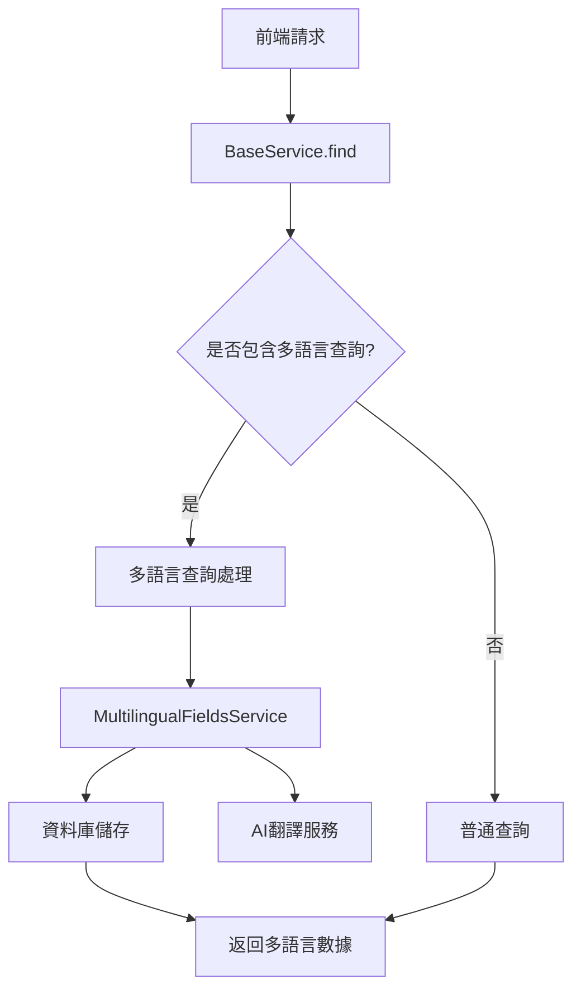

# 多語言欄位系統 (Multilingual Fields)

多語言欄位系統是項目中處理國際化內容的核心模組，允許同一個欄位儲存多種語言的內容，並提供自動翻譯、查詢和管理的功能。

## 系統架構

### 核心組件



### 數據結構

#### MultilingualFieldsEntity
```typescript
{
  id: string // 主鍵ID
  fieldId: string // 對應欄位ID (格式: multilingual-xxxxx)
  language: string // 語言代碼 (如: zh-TW, en, ja)
  value: string // 該語言的欄位值
  // 繼承 BaseEntity 的基礎欄位
}
```

## 工作原理

### 1. 多語言欄位識別

系統通過檢查欄位值是否以 `multilingual-` 開頭來識別多語言欄位：

```typescript
// 普通欄位
{
  title: "Hello World",
  description: "This is a description"
}

// 多語言欄位
{
  title: "multilingual-12345",      // 多語言欄位
  description: "multilingual-67890" // 多語言欄位
}
```

### 2. 查詢流程

#### 前端查詢請求
```typescript
// 前端發送查詢請求
{
  pageSize: 10,
  currentPage: 1,
  multilingualFields: ["title", "description"], // 指定需要多語言查詢的欄位
  title: "標題內容" // 根據多語言內容查詢
}
```

#### 後端處理流程
1. **識別多語言欄位**: 檢查 `multilingualFields` 參數
2. **查詢多語言映射**: 在 `multilingual-fields` 表中尋找對應的 `fieldId`
3. **生成查詢組合**: 使用笛卡兒積生成所有可能的查詢條件
4. **執行資料庫查詢**: 使用 `fieldId` 進行實際查詢
5. **附加多語言數據**: 將多語言內容附加到查詢結果中

### 3. 返回數據結構

```typescript
// 查詢結果
{
  list: [
    {
      id: "1",
      title: "multilingual-12345",
      description: "multilingual-67890",
      // 其他欄位...

      // 自動附加的多語言數據
      multilingualFields: {
        title: [
          { id: "1", fieldId: "multilingual-12345", language: "zh-TW", value: "標題" },
          { id: "2", fieldId: "multilingual-12345", language: "en", value: "Title" },
          { id: "3", fieldId: "multilingual-12345", language: "ja", value: "タイトル" }
        ],
        description: [
          { id: "4", fieldId: "multilingual-67890", language: "zh-TW", value: "描述" },
          { id: "5", fieldId: "multilingual-67890", language: "en", value: "Description" }
        ]
      }
    }
  ],
  total: 1
}
```

## 核心功能

### 1. 多語言內容管理

#### 創建多語言內容
```typescript
// 創建單個多語言欄位
await multilingualFieldsService.create({
  fieldId: 'multilingual-12345',
  language: 'zh-TW',
  value: '標題內容'
})

// 批次創建
await multilingualFieldsService.createBatch([
  { fieldId: 'multilingual-12345', language: 'zh-TW', value: '標題' },
  { fieldId: 'multilingual-12345', language: 'en', value: 'Title' },
  { fieldId: 'multilingual-12345', language: 'ja', value: 'タイトル' }
])
```

#### 查詢多語言內容
```typescript
// 查詢特定欄位的所有語言版本
const result = await multilingualFieldsService.find({
  fieldId: 'multilingual-12345',
  pageSize: 0 // 不分頁
})
```

#### 更新多語言內容
```typescript
// 更新特定語言版本
await multilingualFieldsService.update({
  id: '1',
  value: '新的標題內容'
})
```

### 2. AI 自動翻譯

#### 語言轉換功能
```typescript
// 將文字轉換為多種語言
const result = await multilingualFieldsService.convertLanguage({
  text: "Hello World",
  targetLanguages: ["zh-TW", "ja", "ko"]
})

// 返回結果
{
  "zh-TW": "你好世界",
  "ja": "こんにちは世界",
  "ko": "안녕하세요 세계"
}
```

#### 翻譯流程
1. 接收原始文字和目標語言列表
2. 調用 AI 翻譯服務 (ChatGPT)
3. 解析 JSON 格式的翻譯結果
4. 返回語言代碼對應的翻譯內容

### 3. 狀態管理

#### 封鎖/解封鎖多語言欄位
```typescript
// 封鎖多語言欄位
await multilingualFieldsService.block('1')

// 解封鎖多語言欄位
await multilingualFieldsService.unblock('1')
```

## 使用場景

### 1. 內容管理系統

```typescript
// 文章管理
const article = {
  title: 'multilingual-article-001',
  content: 'multilingual-article-002',
  category: 'multilingual-category-001'
}

// 查詢時自動返回多語言內容
const result = await find({
  dto: {
    multilingualFields: ['title', 'content', 'category'],
    title: '文章標題'
  },
  repository: articleRepository
})
```

### 2. 產品目錄

```typescript
// 產品資訊
const product = {
  name: 'multilingual-product-001',
  description: 'multilingual-product-002',
  specifications: 'multilingual-product-003'
}
```

### 3. 用戶界面文本

```typescript
// 界面文本
const uiText = {
  buttonText: 'multilingual-ui-001',
  errorMessage: 'multilingual-ui-002',
  helpText: 'multilingual-ui-003'
}
```

## 最佳實踐

### 1. 欄位命名規範

```typescript
// 推薦的 fieldId 命名格式
const fieldId = `multilingual-${entityType}-${fieldName}-${uniqueId}`

// 範例
'multilingual-article-title-001'
'multilingual-product-name-002'
'multilingual-ui-button-003'
```

### 2. 語言代碼標準

```typescript
// 使用標準的語言代碼
const languages = {
  'zh-TW': '繁體中文',
  'zh-CN': '簡體中文',
  'en': 'English',
  'ja': '日本語',
  'ko': '한국어'
}
```

### 3. 性能最佳化

#### 查詢最佳化
```typescript
// 只在需要時使用多語言查詢
const result = await find({
  dto: {
    multilingualFields: ['title'], // 只查詢需要的欄位
    title: '標題'
  },
  repository: articleRepository
})
```

#### 快取策略
```typescript
// 對頻繁查詢的多語言內容進行快取
const cacheKey = `multilingual-${fieldId}`
const cached = await cacheService.get(cacheKey)
if (cached)
  return cached

const result = await multilingualFieldsService.find({ fieldId })
await cacheService.set(cacheKey, result, 3600) // 快取1小時
```

### 4. 錯誤處理

```typescript
try {
  const result = await multilingualFieldsService.convertLanguage({
    text: 'Hello',
    targetLanguages: ['zh-TW', 'ja']
  })
}
catch (error) {
  if (error instanceof BadRequestException) {
    // 處理翻譯失敗
    console.error('翻譯失敗:', error.message)
  }
}
```

## 資料庫設計

### 表結構

```sql
CREATE TABLE system_multilingual_fields (
  id BIGINT PRIMARY KEY AUTO_INCREMENT COMMENT '主鍵ID',
  field_id VARCHAR(50) NOT NULL COMMENT '對應欄位ID',
  language VARCHAR(50) NOT NULL COMMENT '對應語言',
  value VARCHAR(255) NOT NULL COMMENT '欄位值',
  remark VARCHAR(255) COMMENT '備註',
  status TINYINT DEFAULT 1 COMMENT '狀態 0:禁用 1:啟用',
  is_deleted TINYINT DEFAULT 0 COMMENT '是否刪除 0:否 1:是',
  creator BIGINT COMMENT '建立人',
  create_time DATETIME DEFAULT CURRENT_TIMESTAMP COMMENT '建立時間',
  updater BIGINT COMMENT '更新人',
  update_time DATETIME ON UPDATE CURRENT_TIMESTAMP COMMENT '更新時間'
);
```

### 索引建議

```sql
-- 主要查詢索引
CREATE INDEX idx_field_id ON system_multilingual_fields(field_id);
CREATE INDEX idx_language ON system_multilingual_fields(language);
CREATE INDEX idx_field_language ON system_multilingual_fields(field_id, language);

-- 狀態過濾索引
CREATE INDEX idx_status_deleted ON system_multilingual_fields(status, is_deleted);
```

## 配置說明

### 環境變數

```env
# AI 翻譯服務配置
CHAT_GPT_API_KEY=your_chatgpt_api_key

# 多語言相關配置
DEFAULT_LANGUAGE=zh-TW
SUPPORTED_LANGUAGES=zh-TW,en,ja,ko
```

### 服務配置

```typescript
// 在模組中配置
@Module({
  imports: [
    TypeOrmModule.forFeature([MultilingualFieldsEntity]),
    // 其他依賴...
  ],
  providers: [MultilingualFieldsService],
  controllers: [MultilingualFieldsController],
  exports: [MultilingualFieldsService]
})
export class MultilingualFieldsModule {}
```

## 常見問題

### 1. 多語言查詢性能問題

**問題**: 多個多語言欄位會產生笛卡兒積，影響查詢性能

**解決方案**:
- 限制同時查詢的多語言欄位數量
- 使用快取減少重複查詢
- 考慮使用全文搜尋索引

### 2. 翻譯準確性問題

**問題**: AI 翻譯可能不夠準確

**解決方案**:
- 提供人工校對功能
- 支持自訂翻譯
- 使用專業翻譯服務

### 3. 數據一致性問題

**問題**: 多語言數據可能不同步

**解決方案**:
- 實現數據同步機制
- 提供數據校驗功能
- 定期檢查數據完整性

## 擴展功能

### 1. 版本控制

```typescript
// 支持多語言內容的版本控制
interface MultilingualVersion {
  fieldId: string
  language: string
  version: number
  value: string
  isActive: boolean
}
```

### 2. 批次操作

```typescript
// 批次更新多語言內容
await multilingualFieldsService.updateBatch([
  { id: '1', value: '新內容1' },
  { id: '2', value: '新內容2' }
])
```

### 3. 導入導出

```typescript
// 導出多語言數據
const exportData = await multilingualFieldsService.export({
  fieldIds: ['multilingual-001', 'multilingual-002'],
  languages: ['zh-TW', 'en']
})

// 導入多語言數據
await multilingualFieldsService.import(importData)
```

## 總結

多語言欄位系統提供了完整的國際化解決方案，通過與 BaseService 的深度集成，實現了自動化的多語言查詢和管理。系統設計靈活，易於擴展，能夠滿足各種多語言應用的需求。

關鍵優勢：
- **自動化**: 與 BaseService 無縫集成
- **智慧化**: AI 自動翻譯功能
- **靈活性**: 支持任意欄位的多語言化
- **性能最佳化**: 智慧查詢和快取機制
- **易用性**: 簡單的 API 介面
