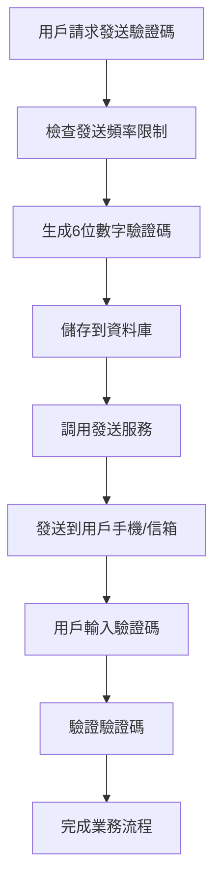

# 驗證碼發送服務集成指南

本指南將教您如何將自己的驗證碼發送服務集成到項目中。目前項目已經完成了驗證碼的生成、儲存和驗證邏輯，您只需要實現實際的發送功能即可。

## 現有驗證碼架構

### 核心組件

1. **VerifyCodeUtils**: 驗證碼工具類，提供生成、發送和驗證的統一介面
2. **VerifyCodeService**: 驗證碼資料庫操作服務
3. **AuthService**: 認證服務，使用驗證碼進行註冊和密碼重設

### 驗證碼流程



## 集成點說明

### 1. 主要集成位置

在 `src/utils/verify-code-utils.ts` 文件中有兩個 TODO 標記的位置：

```typescript
// 第72行 - 新驗證碼發送
// TODO：在此處執行發送驗證碼的邏輯

// 第101行 - 重新發送驗證碼
// TODO：在此處執行發送驗證碼的邏輯
```

### 2. 可用的參數

在集成點，您可以使用以下參數：

```typescript
// 驗證碼資訊
const code = StrGenerator.generateNumeric(6) // 6位數字驗證碼

// 用戶資訊
const userId = userId // 用戶ID（可能為空）
const userEmail = userEmail // 用戶信箱
const userMobile = userMobile // 用戶手機號碼

// 場景資訊
const type = type // 'email' 或 'mobile'
const scene = scene // 'register' 或 'retrieve-password'
```

## 集成方案

### 方案一：直接在 VerifyCodeUtils 中集成

**優點**: 簡單直接，修改量小
**缺點**: 耦合度高，不利於擴展

**實現思路**:
1. 在 TODO 位置添加發送邏輯
2. 根據 `type` 判斷髮送方式（信箱/手機）
3. 調用對應的發送服務

### 方案二：創建獨立的發送服務

**優點**: 解耦，易於維護和測試
**缺點**: 需要創建額外的服務類

**實現思路**:
1. 創建 `VerifyCodeSenderService` 服務
2. 在 VerifyCodeUtils 中注入並調用
3. 支持多種發送方式（信箱、簡訊、推送等）

### 方案三：使用事件驅動模式

**優點**: 完全解耦，支持非同步處理
**缺點**: 架構複雜，需要事件系統

**實現思路**:
1. 定義驗證碼發送事件
2. 在 TODO 位置發送事件
3. 創建事件監聽器處理發送邏輯

## 具體集成步驟

### 步驟 1: 選擇集成方案

根據您的項目需求和團隊技術棧選擇合適的方案。推薦使用**方案二**，既保持了代碼的整潔性，又便於後續擴展。

### 步驟 2: 創建發送服務

創建一個專門的驗證碼發送服務，例如：

```typescript
// src/services/verify-code-sender.service.ts
@Injectable()
export class VerifyCodeSenderService {
  async sendEmailCode(email: string, code: string, scene: string) {
    // 實現信箱發送邏輯
  }

  async sendMobileCode(mobile: string, code: string, scene: string) {
    // 實現簡訊發送邏輯
  }
}
```

### 步驟 3: 修改 VerifyCodeUtils

在 TODO 位置添加發送邏輯：

```typescript
// 注入發送服務
constructor(private readonly senderService: VerifyCodeSenderService) {}

// 在生成驗證碼後添加發送邏輯
if (type === 'email') {
  await this.senderService.sendEmailCode(userEmail, code, scene)
} else if (type === 'mobile') {
  await this.senderService.sendMobileCode(userMobile, code, scene)
}
```

### 步驟 4: 配置環境變數

添加發送服務所需的配置：

```env
# 信箱服務配置
SMTP_HOST=smtp.example.com
SMTP_PORT=587
SMTP_USER=your-email@example.com
SMTP_PASS=your-password

# 簡訊服務配置
SMS_API_KEY=your-sms-api-key
SMS_API_URL=https://api.sms-provider.com
```

## 常見發送服務集成

### 1. 信箱發送服務

**推薦服務商**:
- SendGrid
- AWS SES
- 阿里雲郵件推送
- 騰訊雲郵件推送

**集成要點**:
- 配置 SMTP 或 API 介面
- 設計郵件模板
- 處理發送失敗重試

### 2. 簡訊發送服務

**推薦服務商**:
- 阿里雲簡訊服務
- 騰訊雲簡訊
- Twilio
- 華為雲簡訊

**集成要點**:
- 申請簡訊模板
- 配置簽名和模板ID
- 處理發送頻率限制

### 3. 推送通知

**適用場景**:
- 行動應用內驗證碼
- 即時通訊軟體通知

**集成要點**:
- 集成推送服務SDK
- 處理設備令牌管理
- 設計推送內容模板

## 錯誤處理建議

### 1. 發送失敗處理

```typescript
try {
  await this.senderService.sendCode(...)
} catch (error) {
  // 記錄錯誤日誌
  console.error('驗證碼發送失敗:', error)

  // 可選：刪除已創建的驗證碼記錄
  await verifyCodeService.deleteUserAllVerifyCodes(userId)

  // 拋出用戶友好的錯誤資訊
  throw new BadRequestException('驗證碼發送失敗，請稍後重試')
}
```

### 2. 重試機制

```typescript
async sendWithRetry(sendFunction: () => Promise<void>, maxRetries = 3) {
  for (let i = 0; i < maxRetries; i++) {
    try {
      await sendFunction()
      return
    } catch (error) {
      if (i === maxRetries - 1) throw error
      await new Promise(resolve => setTimeout(resolve, 1000 * (i + 1)))
    }
  }
}
```

## 測試建議

### 1. 單元測試

```typescript
describe('VerifyCodeSenderService', () => {
  it('should send email verification code', async () => {
    // 測試信箱發送功能
  })

  it('should send mobile verification code', async () => {
    // 測試簡訊發送功能
  })
})
```

### 2. 集成測試

```typescript
describe('VerifyCode Integration', () => {
  it('should complete full verification flow', async () => {
    // 測試完整的驗證碼流程
  })
})
```

## 性能最佳化建議

### 1. 非同步發送

```typescript
// 不等待發送結果，提高響應速度
setImmediate(async () => {
  try {
    await this.senderService.sendCode(...)
  } catch (error) {
    console.error('非同步發送失敗:', error)
  }
})
```

### 2. 發送隊列

```typescript
// 使用隊列處理大量發送請求
await this.sendQueue.add('send-verify-code', {
  type,
  recipient,
  code,
  scene
})
```

### 3. 快取機制

```typescript
// 快取發送結果，避免重複發送
const cacheKey = `verify-code-${type}-${recipient}`
if (await this.cacheService.exists(cacheKey)) {
  throw new BadRequestException('請勿重複發送')
}
```

## 監控和日誌

### 1. 發送統計

```typescript
// 記錄發送統計資訊
await this.metricsService.increment('verify_code_sent', {
  type,
  scene,
  success: true
})
```

### 2. 錯誤追蹤

```typescript
// 記錄詳細的錯誤資訊
this.logger.error('驗證碼發送失敗', {
  type,
  recipient,
  error: error.message,
  stack: error.stack
})
```

## 安全注意事項

### 1. 發送頻率限制

- 實現 IP 級別的發送頻率限制
- 實現用戶級別的發送頻率限制
- 實現全局發送頻率限制

### 2. 敏感資訊保護

- 不要在日誌中記錄完整的驗證碼
- 不要在錯誤資訊中洩露用戶資訊
- 使用 HTTPS 進行 API 調用

### 3. 驗證碼安全

- 設置合理的過期時間
- 限制驗證碼嘗試次數
- 驗證碼使用後立即失效

## 總結

通過以上指南，您可以根據自己的需求選擇合適的集成方案，並實現可靠的驗證碼發送功能。記住要考慮錯誤處理、性能最佳化、安全性和可維護性，以確保系統的穩定運行。
